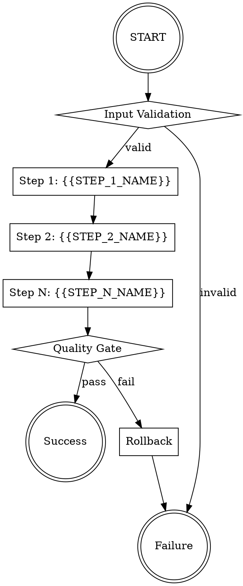

# {{WORKFLOW_NAME}}

## Overview

{{WORKFLOW_DESCRIPTION}}

**Core Principle:** Atomic operations with full audit trail and automated rollback on failure.

## Workflow Structure



## Modes

### EXECUTE Mode

Run the workflow steps sequentially with checkpointing.

**Command:**
```bash
{{WORKFLOW_COMMAND}} execute --input {{INPUT_FILE}} --checkpoint {{CHECKPOINT_DIR}}
```

**Process:**
1. Load and validate input parameters
2. Execute Step 1: {{STEP_1_NAME}}
   - {{STEP_1_DESCRIPTION}}
   - Checkpoint: `{{CHECKPOINT_DIR}}/step1.json`
3. Execute Step 2: {{STEP_2_NAME}}
   - {{STEP_2_DESCRIPTION}}
   - Checkpoint: `{{CHECKPOINT_DIR}}/step2.json`
4. Execute Step N: {{STEP_N_NAME}}
   - {{STEP_N_DESCRIPTION}}
   - Checkpoint: `{{CHECKPOINT_DIR}}/stepN.json`
5. Run quality gates
6. Mark workflow complete

**Resume from checkpoint:**
```bash
{{WORKFLOW_COMMAND}} execute --resume {{CHECKPOINT_DIR}}/step{N}.json
```

### SCHEDULE Mode

Schedule workflow execution via cron.

**Command:**
```bash
{{WORKFLOW_COMMAND}} schedule --cron "{{CRON_EXPRESSION}}" --timezone {{TIMEZONE}}
```

**Schedule Configuration:**
- **Cron:** `{{CRON_EXPRESSION}}` (e.g., `0 2 * * *` for daily at 2 AM)
- **Timezone:** {{TIMEZONE}} (default: UTC)
- **Input Source:** {{SCHEDULED_INPUT_SOURCE}}
- **Notification:** {{NOTIFICATION_ENDPOINT}}

**List scheduled jobs:**
```bash
{{WORKFLOW_COMMAND}} schedule --list
```

**Remove schedule:**
```bash
{{WORKFLOW_COMMAND}} schedule --remove {{SCHEDULE_ID}}
```

### ROLLBACK Mode

Undo workflow execution and restore previous state.

**Command:**
```bash
{{WORKFLOW_COMMAND}} rollback --execution-id {{EXECUTION_ID}} --to-step {{STEP_NUMBER}}
```

**Rollback Process:**
1. Load execution audit trail from `{{AUDIT_LOG_PATH}}/{{EXECUTION_ID}}.log`
2. Identify completed steps (1 through N)
3. Execute rollback operations in reverse order:
   - Rollback Step N: {{STEP_N_ROLLBACK_ACTION}}
   - Rollback Step 2: {{STEP_2_ROLLBACK_ACTION}}
   - Rollback Step 1: {{STEP_1_ROLLBACK_ACTION}}
4. Verify rollback success
5. Update audit log with rollback completion

**Partial rollback:**
```bash
{{WORKFLOW_COMMAND}} rollback --execution-id {{EXECUTION_ID}} --to-step 2
```

## Quality Gates

| Gate | Metric | Threshold | Action on Failure |
|------|--------|-----------|-------------------|
| Success Rate | {{SUCCESS_RATE_METRIC}} | >= {{SUCCESS_RATE_THRESHOLD}}% | Trigger rollback |
| Rollback Success | {{ROLLBACK_SUCCESS_METRIC}} | >= {{ROLLBACK_SUCCESS_THRESHOLD}}% | Alert operator |
| Audit Completeness | {{AUDIT_COMPLETENESS_METRIC}} | == {{AUDIT_COMPLETENESS_THRESHOLD}}% | Block completion |
| {{CUSTOM_GATE_1}} | {{CUSTOM_METRIC_1}} | {{CUSTOM_THRESHOLD_1}} | {{CUSTOM_ACTION_1}} |
| {{CUSTOM_GATE_2}} | {{CUSTOM_METRIC_2}} | {{CUSTOM_THRESHOLD_2}} | {{CUSTOM_ACTION_2}} |

## Security Baseline

### Atomic Operations

- All state changes use transactions
- Checkpoints written before step completion
- No partial state commits
- Idempotent step execution

### Audit Trail

Every execution generates:
- `{{AUDIT_LOG_PATH}}/{{EXECUTION_ID}}.log` - Full execution trace
- `{{AUDIT_LOG_PATH}}/{{EXECUTION_ID}}.inputs.json` - Input parameters
- `{{AUDIT_LOG_PATH}}/{{EXECUTION_ID}}.outputs.json` - Step outputs
- `{{AUDIT_LOG_PATH}}/{{EXECUTION_ID}}.metrics.json` - Quality gate results

**Log format:**
```json
{
  "timestamp": "{{TIMESTAMP_FORMAT}}",
  "execution_id": "{{EXECUTION_ID}}",
  "step": "{{STEP_NAME}}",
  "action": "start|complete|rollback",
  "checksum": "{{STEP_CHECKSUM}}",
  "operator": "{{OPERATOR_ID}}"
}
```

## Input Specification

```yaml
workflow: {{WORKFLOW_NAME}}
version: {{WORKFLOW_VERSION}}
parameters:
  {{PARAM_1_NAME}}: {{PARAM_1_VALUE}}
  {{PARAM_2_NAME}}: {{PARAM_2_VALUE}}
  {{PARAM_N_NAME}}: {{PARAM_N_VALUE}}
options:
  timeout: {{TIMEOUT_SECONDS}}
  retries: {{MAX_RETRIES}}
  parallel: {{ALLOW_PARALLEL}}
```

## Common Mistakes

| Mistake | Fix |
|---------|-----|
| Skipping checkpoint validation | Always verify checksums before resume |
| Manual state changes | Use workflow commands only - never edit checkpoint files directly |
| Ignoring rollback failures | Rollback failures require immediate operator intervention |
| Missing input validation | Validate all inputs before first step execution |
| Non-idempotent steps | Design steps to be safely re-executable |

## Quick Reference

| Task | Command |
|------|---------|
| Execute workflow | `{{WORKFLOW_COMMAND}} execute --input {{INPUT_FILE}}` |
| Resume from checkpoint | `{{WORKFLOW_COMMAND}} execute --resume {{CHECKPOINT_FILE}}` |
| Schedule workflow | `{{WORKFLOW_COMMAND}} schedule --cron "{{CRON_EXPRESSION}}"` |
| List schedules | `{{WORKFLOW_COMMAND}} schedule --list` |
| Rollback execution | `{{WORKFLOW_COMMAND}} rollback --execution-id {{EXECUTION_ID}}` |
| View audit log | `{{WORKFLOW_COMMAND}} audit --execution-id {{EXECUTION_ID}}` |
| Check status | `{{WORKFLOW_COMMAND}} status --execution-id {{EXECUTION_ID}}` |

## Rollback Checklist

- [ ] Verify execution ID exists in audit log
- [ ] Confirm no dependent workflows in progress
- [ ] Check rollback success rate threshold
- [ ] Notify {{ROLLBACK_NOTIFICATION_TARGET}}
- [ ] Document rollback reason: {{ROLLBACK_REASON}}
- [ ] Verify state restoration
- [ ] Update incident log
