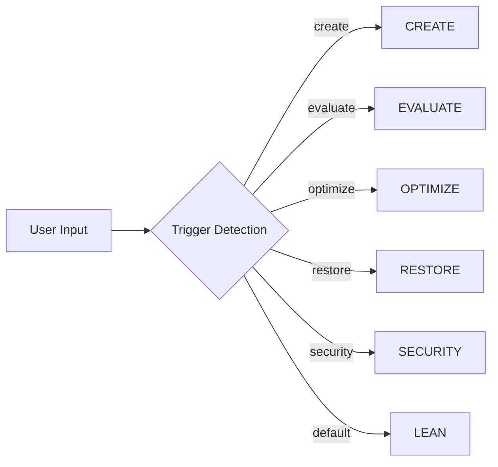
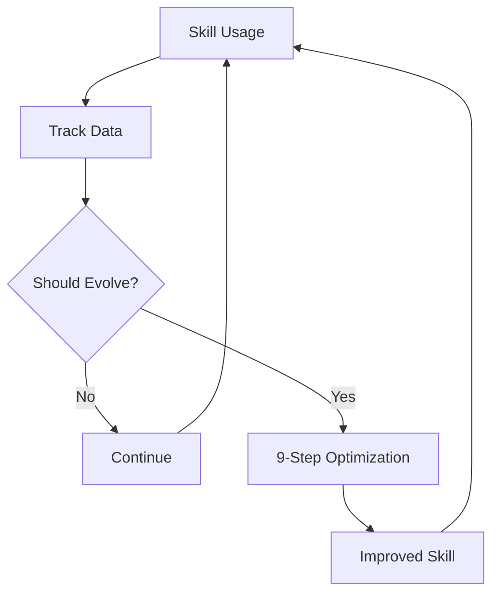

# Skill System Overview

[](SKILL.md)
[](scripts/lean-orchestrator.sh)
[](LICENSE)

## Project Introduction

Skill System is a comprehensive methodology for managing the complete lifecycle of AI agent skills—from specification through autonomous optimization to production certification.

**Authors**: theneoai | **Version**: 2.0.0 | **Standard**: agentskills.io v2.1.0

---

## Value Proposition

### 1. Lean Evaluation (~0 seconds, $0 cost)
Traditional LLM-based evaluation costs time and money. Our lean evaluation uses heuristic-based scoring to provide instant feedback during development.

### 2. Multi-LLM Cross-Validation
All critical decisions use 2-3 LLM providers (Anthropic, OpenAI, Kimi, MiniMax) for cross-validation, ensuring high-quality outputs.

### 3. Autonomous Optimization
The 9-step optimization loop continuously improves skills based on usage data, without human intervention.

---

## Core Features

| Feature | Description |
|---------|-------------|
| **6 Modes** | CREATE, EVALUATE, LEAN, RESTORE, SECURITY, OPTIMIZE |
| **9-Step Loop** | READ → ANALYZE → CURATION → PLAN → IMPLEMENT → VERIFY → HUMAN_REVIEW → LOG → COMMIT |
| **4-Tier Cert** | PLATINUM ≥950, GOLD ≥900, SILVER ≥800, BRONZE ≥700 |
| **OWASP AST10** | 10-item security checklist |
| **Auto-Evolve** | Threshold + Scheduled + Usage-based triggers |

---

## Quick Comparison

| Aspect | Traditional | Skill System |
|--------|-------------|-------------|
| Evaluation Time | 2-5 minutes | 0 seconds (lean) |
| Evaluation Cost | $0.50-2.00 | $0 (lean) |
| Optimization | Manual | Autonomous |
| Security Audit | Separate tool | Built-in |
| Multi-LLM | Optional | Standard |

---

## Core Concepts

### Skill Modes



### Lean vs Full Evaluation

| Phase | Lean | Full |
|-------|------|------|
| Parse | 100pts (grep) | 100pts |
| Text | 350pts (heuristic) | 350pts |
| Runtime | 50pts (patterns) | 450pts |
| Total | 500pts | 1000pts |
| Time | ~0s | ~2min |
| Cost | $0 | ~$0.50 |

---

## Getting Started

1. **Quick Eval**: `./scripts/lean-orchestrator.sh SKILL.md`
2. **Create Skill**: `./scripts/create-skill.sh "My Skill"`
3. **Optimize**: `./scripts/optimize-skill.sh SKILL.md auto`
4. **Security Audit**: `./scripts/security-audit.sh SKILL.md`

---

## Architecture Overview

```
┌─────────────────────────────────────────────────────────────────┐
│                         User Interface                            │
│                    (scripts/ + SKILL.md)                         │
└─────────────────────────────────────────────────────────────────┘
                                │
                                ▼
┌─────────────────────────────────────────────────────────────────┐
│                    ENGINE - Lifecycle Management                  │
│                                                                      │
│  ┌──────────┐  ┌──────────┐  ┌──────────┐  ┌──────────┐         │
│  │ CREATE   │  │ EVALUATE │  │ RESTORE  │  │ SECURITY │         │
│  └──────────┘  └──────────┘  └──────────┘  └──────────┘         │
│                                │                                   │
│                    ┌──────────┴──────────┐                        │
│                    │   EVOLUTION          │                        │
│                    │   (9-step loop)      │                        │
│                    └─────────────────────┘                        │
└─────────────────────────────────────────────────────────────────┘
                                │
                                ▼
┌─────────────────────────────────────────────────────────────────┐
│                    EVAL - Quality Assurance                        │
│                                                                      │
│  ┌─────────┐  ┌─────────┐  ┌─────────┐  ┌─────────┐            │
│  │ Parse   │  │  Text   │  │ Runtime │  │ Certify │            │
│  │ Phase 1 │  │ Phase 2 │  │ Phase 3 │  │ Phase 4 │            │
│  └─────────┘  └─────────┘  └─────────┘  └─────────┘            │
└─────────────────────────────────────────────────────────────────┘
```

---

## Key Innovation: Use-Then-Evolve

The system learns from usage data to trigger self-evolution:

1. **Track**: Collect trigger accuracy, task completion, feedback
2. **Analyze**: Extract patterns and improvement hints
3. **Evolve**: Run 9-step optimization when needed
4. **Repeat**: Continuous improvement cycle



---

## Documentation Structure

| Directory | Purpose |
|-----------|---------|
| `product/` | Project overview, roadmap, changelog |
| `user/` | Quick start, tutorials, workflow guides |
| `technical/` | Architecture, design, core modules |
| `reference/` | SKILL.md spec, metrics, thresholds |

---

**Related Documents**:
- [User Quick Start](../user/QUICKSTART.md)
- [Architecture](../technical/ARCHITECTURE.md)
- [SKILL.md Spec](../reference/SKILL.md)