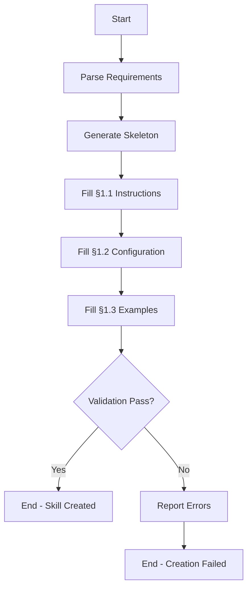

# Skill Creation Workflow

**Version:** 1.0  
**Last Updated:** 2026-03-28  
**Workflow Engine:** `engine/orchestrator.sh`

The skill creation workflow generates a new skill file from a natural language description, using LLM-based generation to produce a complete, valid skill document.

---

## Table of Contents

1. [流程概览](#1-流程概览)
2. [触发条件](#2-触发条件)
3. [前置条件](#3-前置条件)
4. [完整流程](#4-完整流程)
5. [CLI 参考](#5-cli-参考)
6. [错误处理](#6-错误处理)
7. [最佳实践](#7-最佳实践)
8. [相关文档](#8-相关文档)

---

## 1. 流程概览



---

## 2. 触发条件

| Trigger | Condition | Command |
|---------|-----------|---------|
| Manual | User invokes with description | `./scripts/create-skill.sh "description"` |
| Manual | User invokes with options | `./scripts/create-skill.sh "description" [output_path] [tier]` |

---

## 3. 前置条件

- [ ] LLM API is configured and accessible
- [ ] `engine/orchestrator.sh` exists and is executable
- [ ] Target directory is writable
- [ ] Valid tier (GOLD, SILVER, BRONZE) if specified

---

## 4. 完整流程

### Step 1: Parse Requirements

**Input**: User-provided skill description, tier, output path  
**Output**: Parsed parameters (skill_name, output_path, tier)  
**处理逻辑**: Validates inputs and derives skill name from description

```bash
./scripts/create-skill.sh "Create a code review skill"
```

**Name derivation rules**:
- Convert to lowercase
- Replace spaces/special chars with hyphens
- Remove leading/trailing hyphens

### Step 2: Generate Skeleton

**Input**: Skill name and tier  
**Output**: Empty skill file structure  
**处理逻辑**: Creates markdown file with skill sections

### Step 3: Fill §1.1 Instructions

**Input**: Description, tier  
**Output**: Completed §1.1 content  
**处理逻辑**: LLM generates detailed instructions based on description

### Step 4: Fill §1.2 Configuration

**Input**: Description, tier  
**Output**: Completed §1.2 content  
**处理逻辑**: LLM generates configuration (input_schema, output_schema, env vars)

### Step 5: Fill §1.3 Examples

**Input**: §1.1 and §1.2 content  
**Output**: Completed §1.3 content  
**处理逻辑**: LLM generates 3-5 examples matching the skill structure

### Step 6: Validate

**Input**: Generated skill file  
**Output**: Validation result  
**处理逻辑**: Checks file structure, schema validity, LLM formatting

---

## 5. CLI 参考

```bash
# Basic usage
./scripts/create-skill.sh "skill description"

# With custom output path
./scripts/create-skill.sh "skill description" ./my-skill.md

# With tier specification
./scripts/create-skill.sh "skill description" ./my-skill.md GOLD

# Available tiers: GOLD, SILVER, BRONZE (default: BRONZE)
```

---

## 6. 错误处理

| Error Code | Cause | Handling |
|------------|-------|----------|
| E1 | Invalid name (empty or contains only special chars) | Show usage message and exit 1 |
| E2 | LLM failure (API error, timeout, quota exceeded) | Display error from orchestrator, suggest retry |
| E3 | Validation failure (invalid structure, schema errors) | Report specific validation errors, suggest manual fix |
| E4 | Output path not writable | Check directory permissions, use different path |
| E5 | Invalid tier specified | Show available tiers and exit with usage |

---

## 7. 最佳实践

1. **Use descriptive names**: "Create a code review skill" produces better results than "code review"
2. **Specify target tier**: GOLD for production skills, SILVER for testing, BRONZE for prototyping
3. **Review generated content**: Always verify §1.1 instructions before using in production
4. **Iterate if needed**: Re-run with modified description if output doesn't match expectations
5. **Validate after creation**: Run `./scripts/evaluate-skill.sh` to verify the created skill

---

## 8. 相关文档

- [Auto-Evolution](AUTO-EVOLVE.md)
- [Quick Start](../QUICKSTART.md)
- [Skill Format](../SKILL-FORMAT.md)
