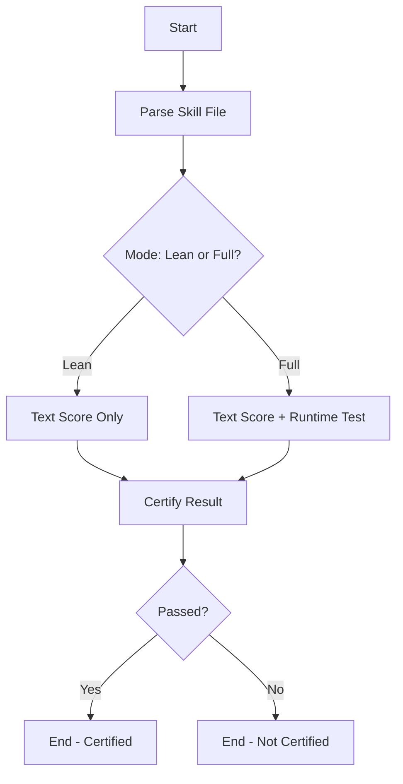

# Skill Evaluation Workflow

**Version:** 1.0  
**Last Updated:** 2026-03-28  
**Workflow Engine:** `eval/main.sh`

The skill evaluation workflow assesses a skill's quality through text-based scoring and optional runtime testing, producing a certification result.

---

## Table of Contents

1. [流程概览](#1-流程概览)
2. [触发条件](#2-触发条件)
3. [前置条件](#3-前置条件)
4. [完整流程](#4-完整流程)
5. [CLI 参考](#5-cli-参考)
6. [错误处理](#6-错误处理)
7. [最佳实践](#7-最佳实践)
8. [相关文档](#8-相关文档)

---

## 1. 流程概览



### Evaluation Modes

| Mode | Duration | Coverage |
|------|----------|----------|
| Lean (fast) | ~0 seconds | Text scoring only |
| Full | ~2 minutes | Text scoring + runtime tests |

---

## 2. 触发条件

| Trigger | Condition | Command |
|---------|-----------|---------|
| Manual | User invokes with skill file | `./scripts/evaluate-skill.sh <skill_file> [mode]` |
| Automated | CI/CD pipeline integration | Via `eval/main.sh --skill <file> --full` |

---

## 3. 前置条件

- [ ] Skill file exists and is readable
- [ ] Skill file follows valid SKILL.md format
- [ ] For Full mode: runtime test dependencies are available
- [ ] Evaluation engine (`eval/main.sh`) is executable

---

## 4. 完整流程

### Step 1: Parse Skill File

**Input**: Path to SKILL.md file  
**Output**: Parsed skill structure  
**处理逻辑**: Validates file exists, reads content, extracts sections

```bash
./scripts/evaluate-skill.sh ./SKILL.md fast
```

### Step 2: Text Score (Lean Mode)

**Input**: Skill content  
**Output**: Text-based quality score (0-100)  
**处理逻辑**: LLM evaluates instruction clarity, example quality, schema validity

### Step 3: Runtime Test (Full Mode Only)

**Input**: Skill file, test cases from §1.3  
**Output**: Runtime execution results  
**处理逻辑**: Executes skill with test inputs, validates outputs

### Step 4: Certify

**Input**: Text score, runtime results (if Full mode)  
**Output**: Certification decision (pass/fail)  
**处理逻辑**: Applies threshold rules (Lean: score ≥ 70, Full: score ≥ 70 + all tests pass)

---

## 5. CLI 参考

```bash
# Basic usage (fast/lean mode by default)
./scripts/evaluate-skill.sh <skill_file>

# Fast/Lean mode
./scripts/evaluate-skill.sh <skill_file> fast

# Full mode with runtime tests
./scripts/evaluate-skill.sh <skill_file> full

# Direct engine usage
cd eval && ./main.sh --skill <skill_file> --fast
cd eval && ./main.sh --skill <skill_file> --full
```

---

## 6. 错误处理

| Error Code | Cause | Handling |
|------------|-------|----------|
| E1 | File not found | Check path, ensure skill file exists |
| E2 | Invalid format (malformed SKILL.md) | Validate syntax, check required sections |
| E3 | LLM failure during scoring | Retry, check API key and quota |
| E4 | Runtime test failure (Full mode) | Review test cases in §1.3, check dependencies |
| E5 | Timeout during execution | Increase timeout or simplify skill |

---

## 7. 最佳实践

1. **Use Lean mode for quick checks**: During development, use `fast` to iterate quickly
2. **Run Full mode before release**: Always certify with full evaluation before production use
3. **Review score breakdown**: Understand why points were deducted to improve the skill
4. **Fix text issues first**: Many runtime failures stem from unclear instructions in §1.1
5. **Maintain test cases**: Keep §1.3 examples current with skill behavior changes

---

## 8. 相关文档

- [Auto-Evolution](AUTO-EVOLVE.md)
- [Quick Start](../QUICKSTART.md)
- [Skill Format](../SKILL-FORMAT.md)
